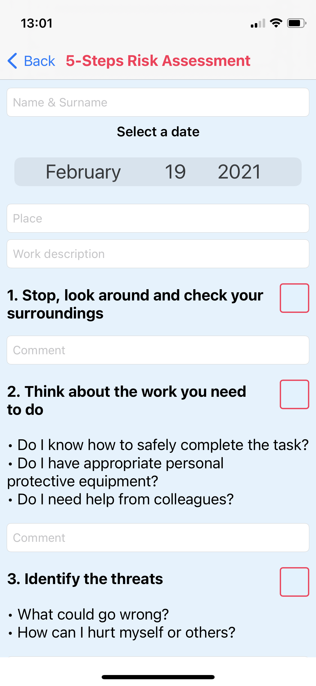

# 📊 5-steps-risk-assessment 

Health & Safety App made for heavy industry, a quick way to make a risk assessment before starting the work. You can send a mail with few taps directly to your supervisor. 

**This app uses:** 
-MVC 
-CoreGraphics 
-MailComposer 
-CocoaPods 
-Git 

**Screenshots:** 
    
    
    
